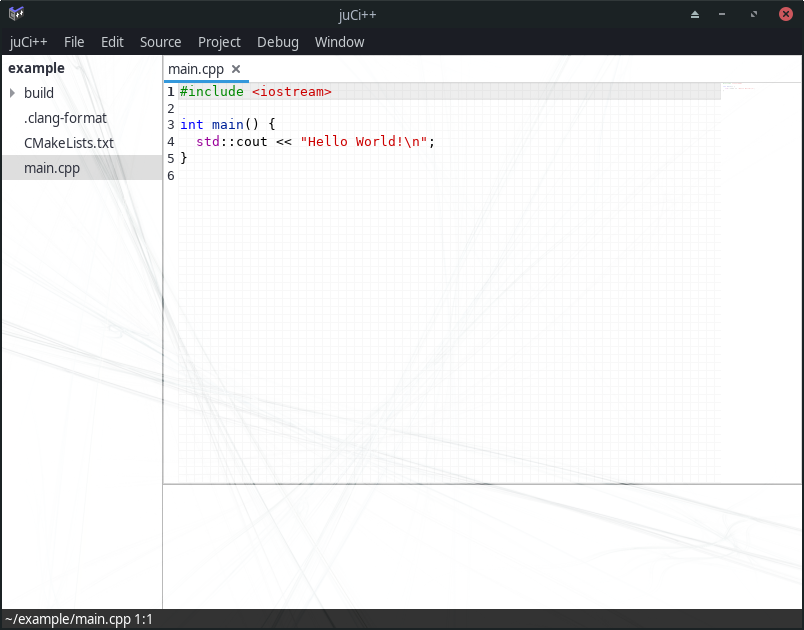

# Custom Styling

You can change the style by creating and modifying a custom style file ~/.config/gtk-3.0/gtk.css.

For instance, the screenshot (background was created with the Gimp render filter Flame):



was made with the following ~/.config/gtk-3.0/gtk.css:

```css
.juci_window {
  background: url('/home/eidheim/Pictures/juci_background.png');
  background-size: 100% 100%;
}

.juci_directories {
  background-color: rgba(255, 255, 255, 0.7);
}

.juci_directories button {
  background-color: rgba(255, 255, 255, 0.7);
}

.juci_directories *:selected {
  background-color: rgba(200, 200, 200, 0.6);
}

.juci_terminal_scrolledwindow {
  background-color: rgba(255, 255, 255, 0.8);
}

.juci_terminal {
  background: transparent;
}

.juci_terminal * {
  background: transparent;
}

.juci_notebook {
  background: transparent;
}

.juci_notebook :not(slider) {
  background-color: rgba(255, 255, 255, 0.8);
}

.juci_notebook * :not(slider) {
  background: transparent;
}

.juci_source_map :not(text) {
  background-color: rgba(200, 200, 200, 0.3);
}

textview.view text selection {
  background-color: #4a90d9;
}

.juci_entry {
  background-color: rgba(255, 255, 255, 0.8);
}

.juci_status_box {
  background-color: rgba(0, 0, 0, 0.8);
}

.juci_status_overlay {
  color: white;
}
```
